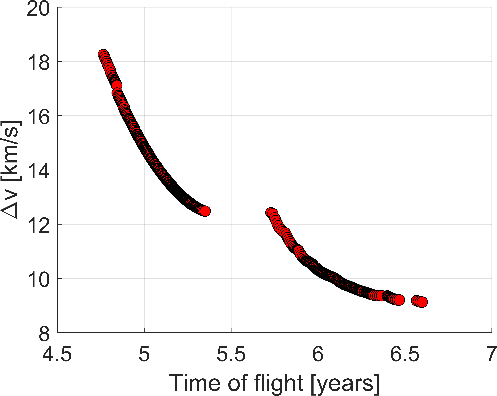
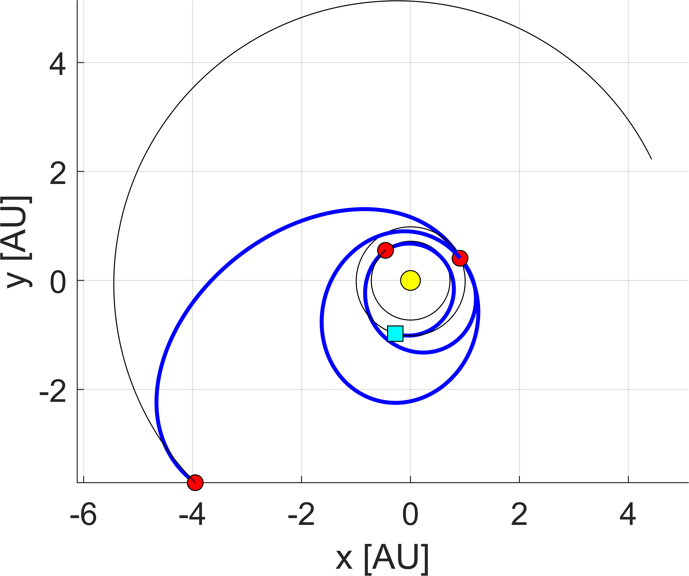
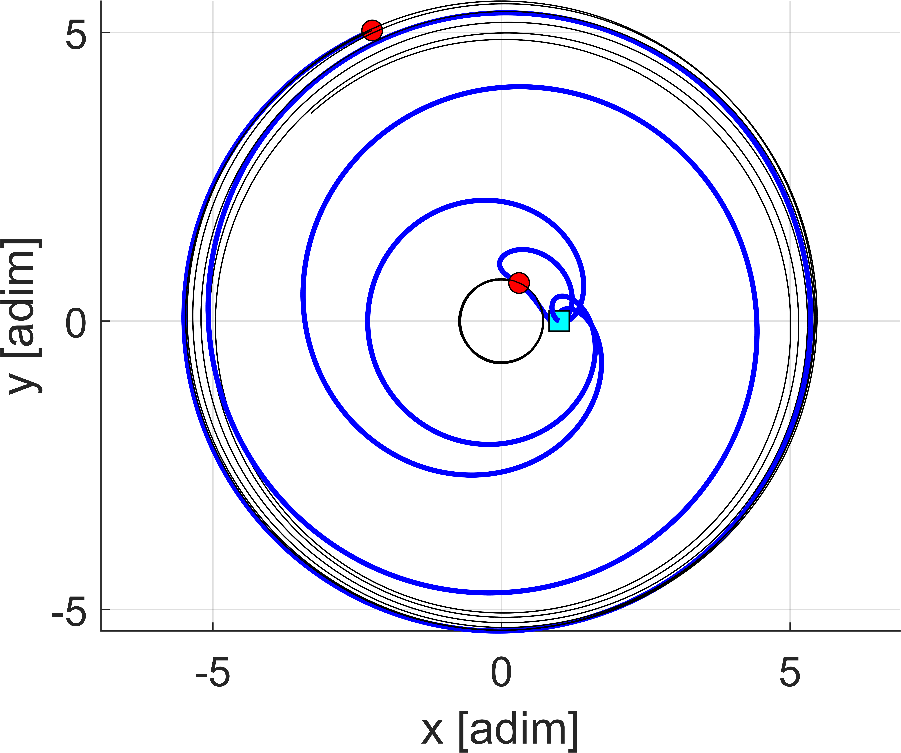
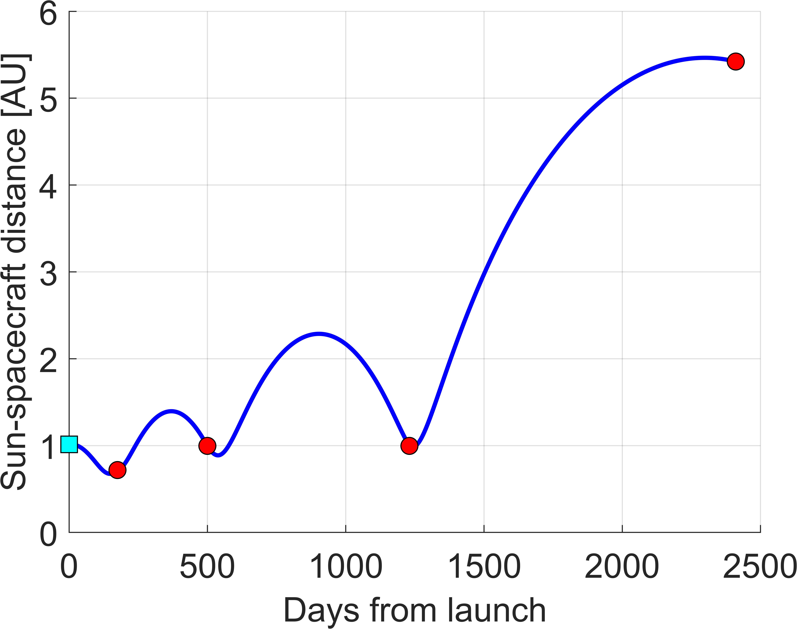
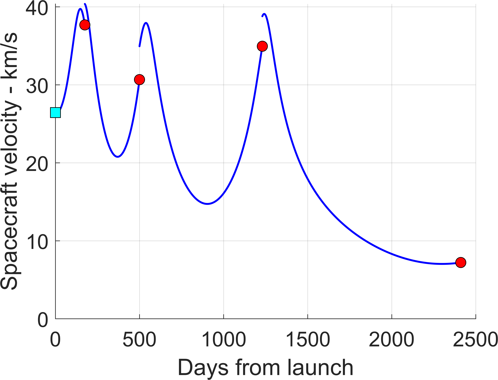
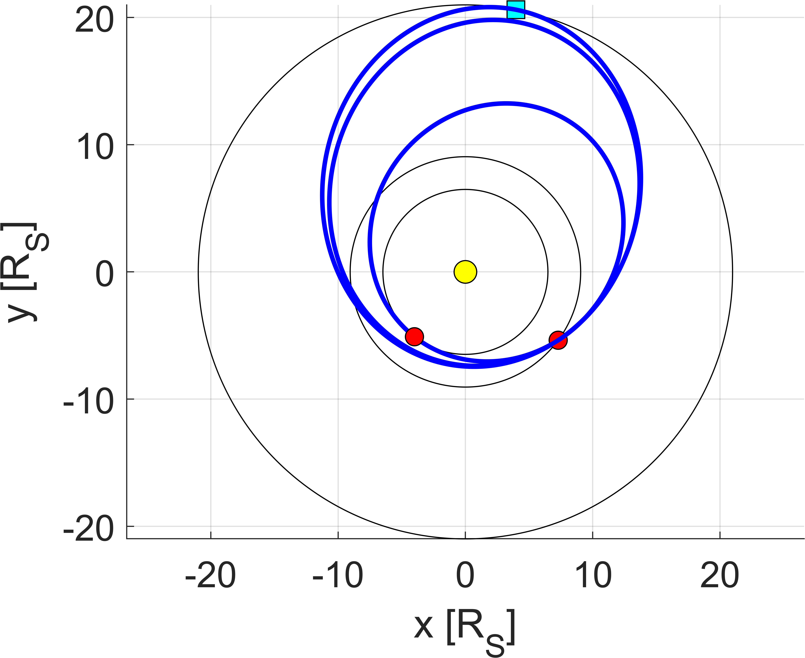
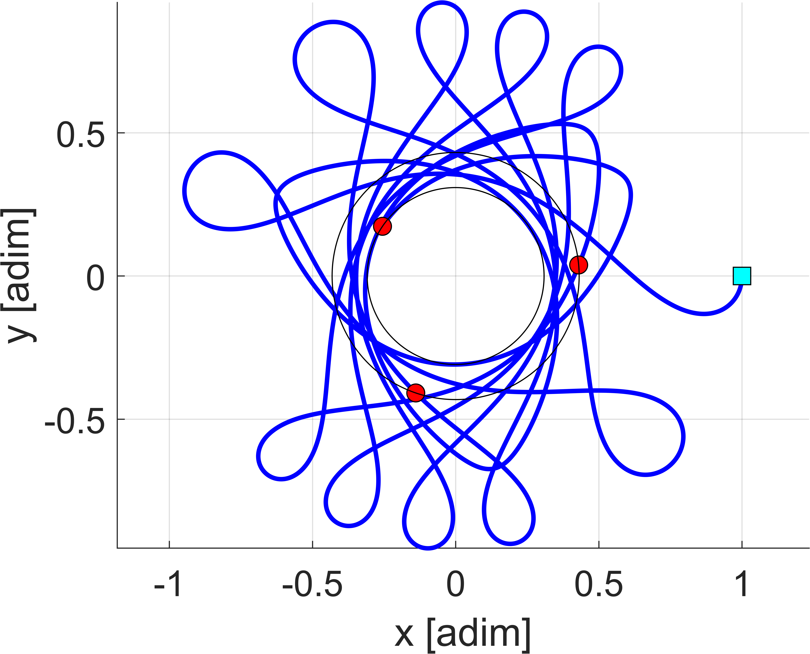
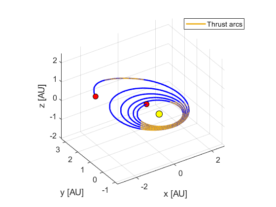
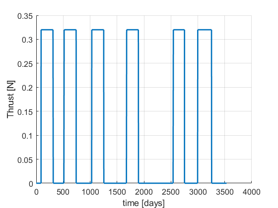
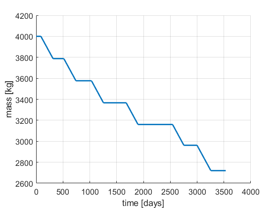

# ASTRA
ASTRA (Automatic Swing-by TRAjectories) is a MATLAB-based toolbox for optimally building multi-gravity assist (MGA) trajectories. This has been built as a result of Andrea Bellome's Ph.D. thesis [[1]](#1). ASTRA is based on Dynamic Programming (DP) to optimize MGA trajectories, both in single-objective (SODP) and multi-objective (MODP).

To cite this folder please use the references [[1]](#1) and [[2]](#2).

## Installation & Requirements

To work with ASTRA, one can simply clone the repository in the local machine:

```bash
git clone "https://github.com/andreabellome/astra"
```

To run a full exploration of MGA trajectories, the following system requirements are recommended:
+ CPU six-core from 2.6 GHz to 3.6 GHz
+ RAM minimum 16 GB
+ Any version of [MATLAB](https://it.mathworks.com/products/matlab.html)>2021b 
+ A compiler for C functions should be used. You can use the [minGW](https://it.mathworks.com/matlabcentral/fileexchange/52848-matlab-support-for-mingw-w64-c-c-fortran-compiler)
<!-- with [Optimization Toolbox](https://it.mathworks.com/products/optimization.html) (this need will be eliminated in the future) -->

Lighter requirements will be required in future releases, as ASTRA will be able to optimize one launch year at a time, and even one date at a time. The price will be the computational time. 

## Usage and test cases

To use the repository, one finds different test scripts. These are listed here:

1. Test script 1: [st1_astra_main.m](/st1_astra_main.m), to optimize MGA missions. Refer to [this section](#Section_1).
2. Test script 2: [st2_astra_main_saturn_system.m](/st2_astra_main_saturn_system.m), to optimize MGA missions using **custom constraints** and **different planetary systems**. Refer to [this section](#Section_2).
3. Test scripts 3-4: [st2_astra_main_uranus_system.m](/st2_astra_main_uranus_system.m) and [st21_astra_main_uranus_system_long_chain.m](./st21_astra_main_uranus_system_long_chain.m), to optimize MGA missions using **custom constraints** and Uranus planetary systems.
4. Test script 5: [low_thrust_trajectories.m](./low_thrust_trajectories.m). This contains a number of test cases for low-thrust trajectories. Please, refer to [this section](#Section_3).
5. Test script 6: [astra_with_custom_eph_mice.m](./astra_with_custom_eph_mice.m). This script shows how to include custom ephemerides, including high-precision .bsp file integrating with [NASA SPICE toolkit](https://naif.jpl.nasa.gov/naif/toolkit.html). Refer to [this section](#Section_4).

### Test script 1: Run DP optimization with ASTRA  <a id="Section_1"></a> 

This script allows to optimize ASTRA using both SODP (single-objective dynamic programming) and MODP (multi-objective dynamic programming). This section provides a breakdown of the minimal input parameters needed. 

The following script is used to add ```ASTRA``` and to build mex functions (namely the Lambert solver and the defects function).

```matlab
clearDeleteAdd;
```

Then one proceeds to select appropriate input parameters. 

```matlab
%% --> input section

% --> clear INPUT and define new ones
try clear INPUT; catch; end; clc;

% --> sequence to be optimized
INPUT.idcentral = 1; 
seq = [ 3 2 3 3 5 ]; res = [ 2 1 3 ];

%%%%%%%%%% multi-rev. options %%%%%%%%%%
maxrev                        = 0;                                         % --> max. number of revolutions (round number)
chosenRevs                    = differentRuns_v2(seq, maxrev);             % --> generate successive runs
[INPUT.chosenRevs, INPUT.res] = processResonances(chosenRevs, res);        % --> process the resonances options
[INPUT.chosenRevs]            = maxRevOuterPlanets(seq, INPUT.chosenRevs); % --> only zero revs. on outer planets
%%%%%%%%%% multi-rev. options %%%%%%%%%%

%%%%%%%%%% set departing options %%%%%%%%%%
t0 = date2mjd2000([2023 1 1 0 0 0]); % --> initial date range (MJD2000)
tf = t0 + 1*365.25;                  % --> final date range (MJD2000)
dt = 2.5;                              % --> step size (days)
INPUT.depOpts = [t0 tf dt];
%%%%%%%%%% set departing options %%%%%%%%%%

%%%%%%%%%% set options %%%%%%%%%%
INPUT.opt      = 2;          % --> (1) is for SODP, (2) is for MODP, (3) is for DATES, (4) is for YEARS - MODP
INPUT.vInfOpts = [3 5];      % --> min/max departing infinity velocities (km/s)
INPUT.dsmOpts  = [1 Inf];    % --> max defect DSM, and total DSMs (km/s)
INPUT.plot     = [0 0];      % --> plot(1) for Pareto front, plot(2) for best traj. DV
INPUT.parallel = true;       % --> put true for parallel, false otherwise
INPUT.tstep    = dt;         % --> step size for Time of flight            
%%%%%%%%%% set options %%%%%%%%%%
```

Things to notice are:

- ```INPUT.idcentral``` allows to select the system. In this example, ```INPUT.idcentral = 1``` means that Solar System is selected. Other options are: 5 for Jupiter system, 6 for Saturn system and 7 for Uranus system. See also [constants.m]() for knowing about the IDs of the bodies.
- ```maxRevOuterPlanets``` will prune options with more than one rev. on legs towards outer planets (i.e., from Jupiter on). This to prevent the mission duration to increase a lot.
- ```res``` is a list of integers with ```[ N, M, LEG_ID ]```, where ```N``` and ```M``` are the object and spacecraft revolutions, respectively, and ```LEG_ID``` is the number of the leg at which the resonance is.
- ```INPUT.opt``` selects the type of optimization. 
```1``` is for SODP
```2``` is for MODP
```3``` is for SODP run each launch date. If the user selects a launch window greater or equal than 1 year, this option is selected automatically.
```4``` is for MODP run each launch year. If the user selects a launch window greater or equal than 3 year, this option is selected automatically.

The options defined above allow for an MGA trajectory search of ```Earth-Venus-Earth-Earth-Jupiter``` mission in year ```2023``` using MODP (```INPUT.opt=2```). There is a specified 2:1 resonance on the ```Earth-Earth``` leg, i.e., ```res = [2 1 3]```.

ASTRA main engine can then be run using:

```matlab
%% --> optimize using ASTRA

% --> launch ASTRA optimization
OUTPUT = ASTRA_DP(seq, INPUT);
```

Results are saved in a structure called ```OUTPUT```.

If needed, one can then post-process the results, extracting the desired trajectory from the Pareto front, plotting the Pareto front itself and the selected path.

```matlab
%% --> extract desired path and plot

close all; clc;

% --> extract path from Pareto front
[path, revs, res] = pathfromPF(OUTPUT);

% --> plot the Pareto front
figPareto = plotPareto(OUTPUT(1).ovPF);

% --> plot the path
[figECI, STRUC, figSYN, figRSC, figVSC] = plotPath(path, INPUT.idcentral);

% --> save the output
generateOutputTXT(path, INPUT.idcentral, './results');
```

The plot of the Pareto front is the following:

<p align="center">
  
</p>

The plot of the optimal trajectory in inertial and Earth-Sun synodic frame is the following:

|  |  |
|:--------------------------------------------:|:--------------------------------------------:|

The function [plotPath.m](./ASTRA/Plot%20and%20save/plotPath.m) also allows to plot the evolutions of spacecraft distance and velocity with respect to central body:

|  |  |
|:--------------------------------------------:|:--------------------------------------------:|

The function [generateOutputTXT.m](./ASTRA/Plot%20and%20save/generateOutputTXT.m) creates a .txt file in a folder called ```./results``` that has all the info of the trajectory. This is reported here:

```

          _/_/_/     _/_/_/  _/_/_/_/_/  _/_/_/    _/_/_/ 
        _/    _/   _/           _/     _/    _/  _/    _/ 
       _/_/_/_/     _/_/       _/     _/_/_/    _/_/_/_/  
      _/    _/         _/     _/     _/    _/  _/    _/   
     _/    _/    _/_/_/      _/     _/    _/  _/    _/    


               - ASTRA solution - 

-------------------------------------------------------------- 

Departing body                 : Earth  
Distance from the central body : 1.0000 AU 

-------------------------------------------------------------- 

Arrival body                   : Jupiter
Distance from the central body : 5.2026 AU 
Departing C3                   : 11.1821 km^2/s^2 
Departing infinity velocity    : 3.3440 km/s 
Arrival infinity velocity      : 5.5560 km/s 
Total cost (DSMs)              : 0.2297 km/s 
Total cost                     : 9.1297 km/s 
Time of flight                 : 6.5995 years 

-------------------------------------------------------------- 

MGA Details : 

Swing-by sequence      : -E--V--E--E--J-

Departing date         : [2023   6   5   0   0   0]
Arrival date           : [2030   1   9  11  32  29]
Time of flight per leg : 175 days 
                         325 days 
                         730.4809 days 
                         1180 days 

DSMs magnitudes        : 0 km/s 
                         0 km/s 
                         0.0025302 km/s 
                         0 km/s 
                         0.22717 km/s 

Infinity velocities    : 
Earth   - Venus        : 3.344 - 5.5398 km/s 
Venus   - Earth        : 5.5423 - 9.3649 km/s 
Earth   - Earth        : 9.3649 - 9.3667 km/s 
Earth   - Jupiter      : 9.5899 - 5.556 km/s 

State at departure/arrival (km and km/s) : 
Earth                         : [-41536210.28622      -145973470.626                   0      25.22061812303     -7.815385638442     -1.511901456476]  
Venus                         : [-68483058.5096      82679154.4959      5068735.73872     -31.9673430837     -19.9046273943      1.44904973131]  

Venus                         : [-68483058.5096      82679154.4959      5068735.73872     -31.8207835326     -24.8436384232    -0.473867544232]  
Earth                         : [136074658.5919      60926320.94723                   0     -20.73484901584      22.55369065354      1.423799578027]  

Earth                         : [136074658.5919      60926320.94723                   0     -21.90609082435      27.19379108781      1.468331664356]  
Earth                         : [136074658.5919      60926320.94723                   0     -21.90609082435      27.19379108781      1.468331664356]  

Earth                         : [136074658.5919      60926320.94723                   0     -19.36823020848      33.54168925672     -2.256209104279]  
Jupiter                       : [-590948699.8079     -555350715.9192      15543181.54531      5.830113194957     -4.241447010639     0.3662016507624]  

Encounter dates        : 
Earth                  : [2023   6   5   0   0   0]
Venus                  : [2023  11  27   0   0   0]
Earth                  : [2024  10  17   0   0   0]
Earth                  : [2026  10  17  11  32  29]
Jupiter                : [2030   1   9  11  32  29]

Transfer types         : 
Earth   - Venus        : outbound - outbound 
Venus   - Earth        : outbound - inbound 
Earth   - Earth        : inbound - inbound 
Earth   - Jupiter      : inbound - inbound 

-------------------------------------------------------------- 
```

Finally, one can further refine the solution around a specified trajectory, to further reduce the defects that might arise:

```matlab
%% --> futher refine around the optimal DV-solution

INPUT.t0days  = 10;   % --> days around current solution departing epoch
INPUT.tofdays = 15;   % --> days around current solution TOFs
INPUT.dt      = 0.5;  % --> step size (days)
INPUT.revs    = revs;
INPUT.res     = res;

% --> further refine using ASTRA
OUTPUTref = refineUsingASTRApath(path, INPUT);
```

### Test script 2: Run DP optimization with ASTRA using custom constraints <a id="Section_2"></a> 

If one wants to set up specific constraints for a custom optimization scenario, it can write as follows:

```matlab
% --> specify custom bounds for TOFs and VINFs
INPUT.TOF_LIM = [[30 60]; [20 40]; [20 40]];
% INPUT.vInfLim = [ [0 XXX]; [0 XXX]; [0 XXX]; [0 XXX]; [0 XXX]];   % --> PL1, PL2, PL3, ...   
```

where the matrix ```INPUT.TOF_LIM``` refers to lower and upper bounds for TOFs per MGA leg, while the matrix ```INPUT.vInfLim``` refers to lower and upper bounds for infinity velocity at each fly-by body.

With the current setup:

```matlab
%% --> input section

% --> clear INPUT and define new ones
try clear INPUT; catch; end; clc;

% --> sequence to be optimized
INPUT.idcentral = 6; % --> central body (Sun in this case)
seq = [ 5 4 4 3 ]; res = [ 13 7 2 ];

%%%%%%%%%% multi-rev. options %%%%%%%%%%
maxrev                        = 3;                                                          % --> max. number of revolutions (round number)
chosenRevs                    = differentRuns_v2(seq, maxrev);                              % --> generate successive runs
[INPUT.chosenRevs, INPUT.res] = processResonances(chosenRevs, res);                         % --> process the resonances options
[INPUT.chosenRevs]            = maxRevOuterPlanets(seq, INPUT.chosenRevs, INPUT.idcentral); % --> only zero revs. on outer planets
%%%%%%%%%% multi-rev. options %%%%%%%%%%

%%%%%%%%%% set departing options %%%%%%%%%%
t0 = date2mjd2000([2023 1 1 0 0 0]); % --> initial date range (MJD2000)
tf = t0 + 0.5*365.25;                  % --> final date range (MJD2000)
dt = 0.1;                            % --> step size (days)
INPUT.depOpts = [t0 tf dt];
%%%%%%%%%% set departing options %%%%%%%%%%

%%%%%%%%%% set options %%%%%%%%%%
INPUT.opt      = 2;          % --> (1) is for SODP, (2) is for MODP, (3) is for DATES, (4) is for YEARS - MODP
INPUT.vInfOpts = [0 2];      % --> min/max departing infinity velocities (km/s)
INPUT.dsmOpts  = [1 Inf];    % --> max defect DSM, and total DSMs (km/s)
INPUT.plot     = [1 1];      % --> plot(1) for Pareto front, plot(2) for best traj. DV
INPUT.parallel = true;       % --> put true for parallel, false otherwise
INPUT.tstep    = dt;         % --> step size for Time of flight            
%%%%%%%%%% set options %%%%%%%%%%

% --> specify custom bounds for TOFs and VINFs
INPUT.TOF_LIM = [[30 60]; [20 40]; [20 40]]; 

%% --> optimize using ASTRA

% --> launch ASTRA optimization
OUTPUT = ASTRA_DP(seq, INPUT);
```

one has the following resulting trajectories:

|  |  |
|:--------------------------------------------:|:--------------------------------------------:|


where the MGA mission is around Saturn, flying-by ```Titan-Rhea-Rhea-Dione```, with a ```13:7``` resonance on the ```Rhea-Rhea``` leg.

The corresponding output is reported here:

```

          _/_/_/     _/_/_/  _/_/_/_/_/  _/_/_/    _/_/_/ 
        _/    _/   _/           _/     _/    _/  _/    _/ 
       _/_/_/_/     _/_/       _/     _/_/_/    _/_/_/_/  
      _/    _/         _/     _/     _/    _/  _/    _/   
     _/    _/    _/_/_/      _/     _/    _/  _/    _/    


               - ASTRA solution - 

-------------------------------------------------------------- 

Departing body                 : Titan
Distance from the central body : 20.9828 Rs 

-------------------------------------------------------------- 

Arrival body                   : Dione  
Distance from the central body : 6.4809 Rs 
Departing C3                   : 2.4048 km^2/s^2 
Departing infinity velocity    : 1.5508 km/s 
Arrival infinity velocity      : 1.7465 km/s 
Total cost (DSMs)              : 0.7016 km/s 
Total cost                     : 3.9988 km/s 
Time of flight                 : 0.3065 years 

-------------------------------------------------------------- 

MGA Details : 

Swing-by sequence      : -T--R--R--D-

Departing date         : [2023   6  24  19  11  59]
Arrival date           : [2023  10  14  17  51   0]
Time of flight per leg : 31.6 days 
                         58.7438 days 
                         21.6 days 

DSMs magnitudes        : 0 km/s 
                         0 km/s 
                         0 km/s 
                         0.70157 km/s 

Infinity velocities    : 
Titan - Rhea         : 1.5508 - 3.4391 km/s 
Rhea    - Rhea         : 3.4391 - 3.4391 km/s 
Rhea    - Dione        : 3.2324 - 1.7465 km/s 

State at departure/arrival (km and km/s) : 
Titan                       : [230777.07612      1199878.4264                 0     -3.9470736019     0.76717345853                 0]  
Rhea                          : [424287.5053     -312766.6167                0      8.215458564      5.523455913                0]  

Rhea                          : [424287.5053     -312766.6167                0      8.174753313      5.428292303                0]  
Rhea                          : [424287.5053     -312766.6167                0      8.174753313      5.428292303                0]  

Rhea                          : [424287.5053     -312766.6167                0      7.602562939      4.866499723                0]  
Dione                         : [-233098.6853     -296804.2178                0      9.251156872     -7.279494237                0]  

Encounter dates        : 
Jupiter                : [2023   6  24  19  11  59]
Mars                   : [2023   7  26   9  35  59]
Mars                   : [2023   9  23   3  27   0]
Earth                  : [2023  10  14  17  51   0]

Transfer types         : 
Titan - Rhea         : outbound - outbound 
Rhea    - Rhea         : outbound - outbound 
Rhea    - Dione        : outbound - outbound 

-------------------------------------------------------------- 
```

### Test script 5: Low-thrust trajectories <a id="Section_3"></a> 

[This script](./low_thrust_trajectories.m) provides a number of test cases for the solution of low-thrust trajectories using ASTRA. In particular, at the moment ASTRA module [Low thrust](./ASTRA/Low%20thrust/) can solve the following optimal control problems
- **Energy-optimal** time-fixed optimal control problem using indirect optimization.
- **Fuel-optimal** time-fixed optimal control problem using indirect optimization (energy-optimal solution is used as first guess).

The script is well commented and should be intuitive to use.

Please note that to run some of the test cases in the script one needs a specific file called ```fuel_optimal_db.csv```, containing parameters of transfers (i.e., initial and final position and velocity vectors, initial mass and time of flight). This can be found in ESA [Zenodo](https://data.niaid.nih.gov/resources?id=zenodo_10972837) repository.

Below, one reports the set-up and results for the Earth-Dionysus case (TEST CASE 5 from the [script](./low_thrust_trajectories.m)).

One loads the parameters:

```matlab
% --> parameters
idcentral = 1;        % --> 1) central body is the Sun
Tmax      = 0.32;     % --> max. thrust                       [N]
Isp       = 3000;     % --> specific impulse                  [s]
m0        = 4000;     % --> initial mass                      [kg]          
g0        = 9.80665;  % --> Earth acceleration at sea level   [m/s]

% --> initialise the parameters
param     = writeParamLT( Tmax, Isp, m0, g0, idcentral, true );
```

And selects initial and final states (expressed in Mean Equinoctial Elements (MEE)), as well as the time of flight. This is taken from [[3]](#3).

```matlab
% --> Earth-to-Dionysus
tStart    = 0;
tEnd      = 3534; % --> please note that in this case the tof is in [days] as this is already scaled!!!
initState = [ 0.999316, -0.004023, 0.015873, -1.623e-5, 1.667e-5, 1.59491 ];
finState  = [ 1.555261 0.152514 -0.519189 0.016353 0.117461 2.36696 ];
```

One finally sets-up the remaining parameters for the search (e.g., the smoothing parameter -- see again Ref. [[3]](#3)) and the number of revolutions:

```matlab
param.tStart = tStart;
param.tEnd   = tEnd;
param.x0     = initState;
param.xf     = finState;

param.plot    = true;
param.rhoLim  = 0.0001;
param.rho     = 1;
param.gamma   = 0.1;
param.iterMax = 5;
param.tol     = 1e-8;

while param.xf(end) < param.x0(end)
    param.xf(end) = param.xf(end) + 2*pi;
end

Nrev            = 5;
param.xf(end)   = param.xf(end) + 2*Nrev*pi;
NrevCheck       = floor(( param.xf(end) - param.x0(end) )/(2*pi));
```

The solution to the fuel-optimal time-fixed control problem is provided by calling:

```matlab
% --> solve the problem
LTsol = wrapSolveFopt( param );
```

The following lines plot the results, whose figures are reported below.

```matlab
% --> plot the solution
transfer                      = LTsol.transfer;
[figTRAJ, figMASS, figTHRmag] = plotLT( transfer, param );
```

The following images show the optimal trajectory from Earth to Dionysus as well as the thrust profile and the mass evolution over time. 

<p align="center">
  
</p>

|  |  |
|:--------------------------------------------:|:--------------------------------------------:|

### Test script 6: Integrating ASTRA with custom ephemerides and NASA SPICE Toolkit <a id="Section_4"></a> 

[This script](./astra_with_custom_eph_mice.m) shows how the user can define custom ephemerides. The test case shown here is for integrating high-precision NASA planetary ephemerides to be integrated with the [SPICE toolkit](https://naif.jpl.nasa.gov/naif/toolkit.html). In particular, the MATLAB interface of SPICE is called MICE.

**Bug detected: currently, using the MICE toolkit prevents ASTRA to be run in parallel mode when resonances are included in the sequence. Next update will eliminate this...**

In order to run such script, one creates a folder called ```MICE_TOOLBOX``` and puts there the ```mice``` folder downloaded from NASA. Then, one can add the toolbox to the path:

```matlab
% --> load custom ephemerides
MICE_path = './MICE_TOOLBOX' ;
addpath(genpath(MICE_path)); % --> always include this
cspice_furnsh([MICE_path '/data.mk']);
```

Note that a ```data.mk``` file is needed, which is the makefile that allows to load the kernels needed by MICE. This should look like the following:

```makefile
KPL/MK


   \begindata

      PATH_VALUES     = ( './MICE_TOOLBOX/mice/Kernel' )

      PATH_SYMBOLS    = ( 'KERNELS' )

      KERNELS_TO_LOAD = (

                          '$KERNELS/naif0012.tls'
			              '$KERNELS/de430.bsp'
                          '$KERNELS/sat375.bsp'
                          '$KERNELS/mar097.bsp'
                          '$KERNELS/gm_de431.tpc'
                          '$KERNELS/pck00010.tpc'
                        )

   \begintext

End of MK.
```

One recognises ```naif0012.tls``` (for leapseconds),  ```gm_de431.tpc``` (for gravity fields), ```pck00010.tpc``` (for bodies properties and orientation), as well as Solar system planetary ephemerides (all those files with ```.bsp``` extension). All of these are available through NASA website.

One then needs a function that allows ASTRA to read those ephemerides. This is provided in [EphSS_from_mice](./ASTRA/Ephemerides%20&%20constants/Eph_MICE_interface/EphSS_from_mice.m). Finally, one can pass it as input in ASTRA by simply setting the field:

```matlab
INPUT.customEphemerides = @EphSS_from_mice;
```

That's it.

ASTRA is now ready to be run with NASA ephemerides. 

[This script](./astra_with_custom_eph_mice.m) optimises an EVEMEJ sequence as a test case. One can check what is the difference between using high-precision ephemerides and approximate position of planets, i.e., those from [EphSS_car.m](./ASTRA/Ephemerides%20&%20constants/Solar%20System/EphSS_car.m) file, by simply removing the line ```INPUT.customEphemerides = @EphSS_from_mice;```, or commenting it.

## Contributing

Currently, only invited developers can contribute to the repository.

## License

The work is under license [CC BY-NC-SA 4.0](https://creativecommons.org/licenses/by-nc/4.0/), that is an Attribution Non-Commercial license.


## References
<a id="1">[1]</a> 
Bellome, A., “Trajectory design of multi-target missions via graph transcription and dynamic programming,” Ph.D. thesis, Cranfield University, 2023.
https://dspace.lib.cranfield.ac.uk/items/711f45c8-e6e4-4f27-909d-94170df400e3

<a id="2">[2]</a> 
Bellome, A., et al. "Multiobjective design of gravity-assist trajectories via graph transcription and dynamic programming." Journal of Spacecraft and Rockets 60.5 (2023): 1381-1399.
https://doi.org/10.2514/1.A35472.

<a id="3">[3]</a>
Junkins, John L., and Ehsan Taheri. "Exploration of alternative state vector choices for low-thrust trajectory optimization." Journal of Guidance, Control, and Dynamics 42.1 (2019): 47-64.
https://doi.org/10.2514/1.G003686
